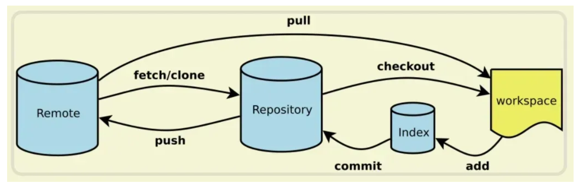

## 一、四大核心区域

| 区域名称          | 中文译名 | 核心作用                                                     |
| :---------------- | :------- | :----------------------------------------------------------- |
| **Workspace**     | 工作区   | 你电脑里直接编辑代码的文件夹（就是打开 IDE 看到的项目文件），是最直观的代码编辑环境。 |
| **Index / Stage** | 暂存区   | Git 内部的临时 “草稿箱”，用来暂存你准备提交的代码修改。可以先把修改放进去，确认无误后再提交到仓库。 |
| **Repository**    | 本地仓库 | Git 在项目目录下生成的 `.git` 文件夹，保存了所有提交的版本历史、分支信息等，是你本地的完整版本库。 |
| **Remote**        | 远程仓库 | 托管在服务器上的共享仓库（如 GitHub/GitLab/Gitee），用于团队协作、代码备份和版本同步。 |


## 二、核心命令与流向解释

1. **`fetch/clone`**

   - `clone`：首次使用时，将**整个远程仓库**完整拷贝到本地（包含所有历史版本）。

   - `fetch`：拉取远程仓库的最新更新，但**不会自动合并**到当前分支，需要手动处理合并，更安全可控。

   

2. **`pull`**

   - 等价于 `fetch + merge`：直接拉取远程最新代码，并自动合并到本地当前分支，让本地代码与远程保持同步。

   

3. **`checkout`**

   - 切换分支，或从本地仓库检出文件到工作区（比如恢复历史版本的文件到当前编辑环境）。

   

4. **`add`**

   - 将工作区的代码修改**添加到暂存区**，比如 `git add .` 会把当前目录下所有修改都加入暂存区。
   - 作用：可以选择性提交修改，避免把不想提交的代码一并提交。

   

5. **`commit`**

   - 将暂存区的修改**打包成一个版本**，提交到本地仓库，并生成一条提交记录（需要用 `-m "备注"` 写清本次修改内容）。
   - 这是本地操作，不会影响远程仓库。

   

6. **`push`**

   - 将本地仓库的提交**推送到远程仓库**，让团队成员可以拉取你的代码更新，完成协作同步。


## 三、最基础的 Git 工作流（团队协作标准流程）

```sh
# 1. 拉取远程最新代码，避免冲突
git pull origin <分支名>

# 2. 在工作区开发功能（编辑代码、新增文件等）
# ... 你的编码工作 ...

# 3. 将工作区修改添加到暂存区
git add .  # 或 git add <具体文件名>，只提交部分修改

# 4. 将暂存区修改提交到本地仓库，添加清晰备注
git commit -m "feat: 完成用户登录功能"  # 备注要清晰，方便回溯

# 5. 将本地提交推送到远程仓库
git push origin <分支名>
```


## 四、关键细节补充

- **暂存区的意义**：可以分批提交修改，比如你改了 3 个文件，但只想提交其中 2 个，就先 `add` 这 2 个，再 `commit`，避免误提交无关代码。
- **`pull` vs `fetch`**：`pull` 是 “懒人操作”，自动合并；`fetch` 更安全，先拉取远程更新，你可以手动查看差异后再合并，适合复杂协作场景。
- **冲突处理**：多人开发时，`push` 前必须先 `pull`，如果远程有别人的新提交，会触发冲突，需要手动解决冲突后再 `commit` + `push`，避免覆盖他人代码。